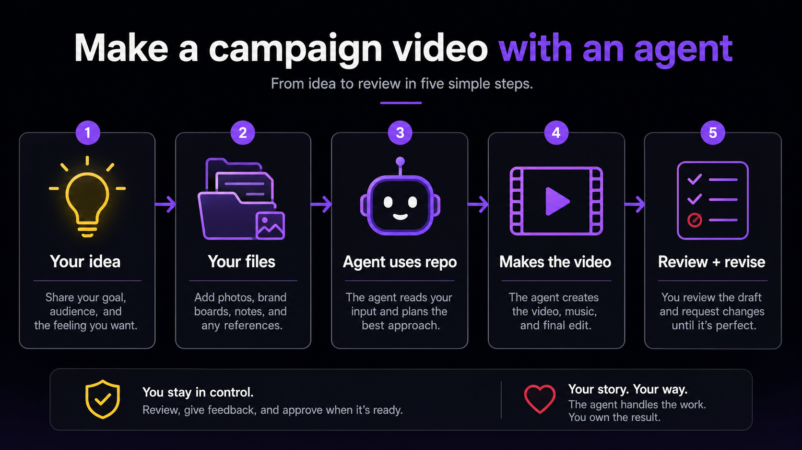
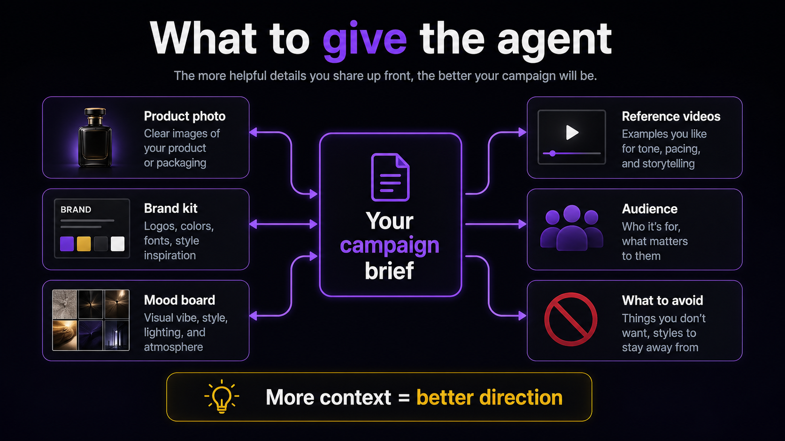
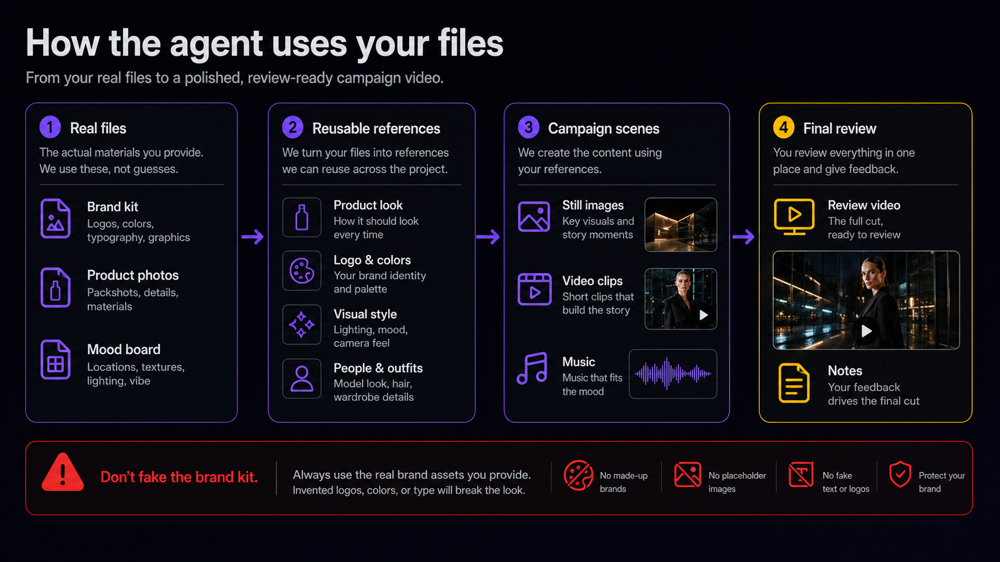
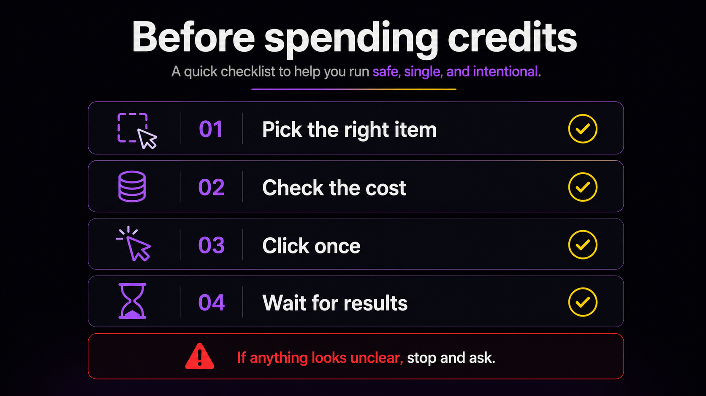

# imagine-campaign-director

A practical guide for using a coding agent with Imagine.Art to make campaign videos from your idea, product photos, brand kit, mood board, and references.

Repo: <https://github.com/theovercomer8/imagine-campaign-director>

`imagine-campaign-director` helps an agent behave less like a random prompt generator and more like a small production team: strategist, creative director, workflow builder, prompt engineer, assistant editor, and QC reviewer.

It is for creators, founders, marketers, filmmakers, and community members who want to turn real source material into an Imagine.Art campaign workflow with a plan, reusable visual references, motion, music when needed, and honest review notes.



## The Short Version

1. Give your agent this repo.
2. Give it your idea and source files.
3. Tell it what kind of campaign you want.
4. The agent plans the campaign before spending credits.
5. It builds the Imagine.Art workflow, makes the assets, checks the result, and packages a review video.

## Who This Is For

Use it when you want an agent to help make:

- Product launch videos
- Fashion, beauty, fragrance, and lifestyle campaigns
- Brand mood films
- App feature promos
- Social ads for TikTok, Reels, YouTube Shorts, or paid media
- Music-led visual spots
- Reference-driven campaign tests from a product photo or brand kit
- Existing workflow audits before spending more credits

## What To Give The Agent

You do not need all of this, but the more context you provide, the less the agent has to guess.



Helpful inputs:

- Your idea: what you want to make, even if it is rough.
- Product photos: packshots, details, labels, materials, or screenshots.
- Brand kit: logo, colors, type, product rules, sample posts, tone.
- Mood board: lighting, locations, textures, fashion references, visual atmosphere.
- Reference videos: examples for pacing, camera style, edits, or taste level.
- Audience: who it is for and what they should feel.
- What to avoid: cliches, styles you hate, wrong audience cues, legal or brand limits.

## Starter Prompt

Copy this into Codex, Claude Code, Cursor, or another coding agent with browser/computer-use access:

```text
Use this repo: https://github.com/theovercomer8/imagine-campaign-director

I want to make a [duration] [format] campaign video for [product / brand / idea].

Here are my source materials: [product photo, brand kit, mood board, references].

The vibe should be [visual direction].
The audience is [audience].
The CTA is [CTA, if any].
Avoid [things to avoid].

Plan the campaign first, then build the Imagine.Art workflow, generate the needed assets, create motion and music if needed, check the result, and package a review video with notes.
```

## What The Agent Should Do

A strong run should follow this order:

1. Understand the brief. What is the product, audience, format, runtime, and goal?
2. Use your real files. Product photos, brand kits, and references should guide the result.
3. Plan before spending. The agent should define the concept, shot list, and music/edit direction first.
4. Create reusable references. The product, brand look, people, wardrobe, and style should stay consistent.
5. Build the Imagine.Art workflow. The workflow should be readable and organized.
6. Generate stills before motion. Still images and keyframes help keep the video consistent.
7. Make motion and music. Animate the approved visuals and generate or import music when the brief needs it.
8. Review honestly. The agent should reject broken outputs and document blockers.
9. Package the result. Final review video, notes, and source manifest.



## Examples

### Product Launch Video

```text
Use imagine-campaign-director to create a 15-second vertical launch ad for this canned drink.
Use the product photo and brand kit as the visual source.
The vibe is moody late-night convenience-store cinema, made for creators and gamers.
Avoid sports drink cliches, smiling-at-camera acting, and fake labels.
Deliver a review video plus notes.
```

### Fashion Campaign

```text
Use imagine-campaign-director to make a 30-second luxury fashion film.
The mood is rain, black glass, chrome, restrained performance, and a strong final hero image.
Keep the model and wardrobe consistent across shots.
Plan the campaign before creating the workflow.
```

### App Feature Promo

```text
Use imagine-campaign-director to make a 20-second promo for this app feature.
Mix clean UI moments with cinematic context shots.
Use captions and deterministic type in the edit.
Make it clear, fast, and premium.
```

### Brand Kit Stress Test

```text
Use imagine-campaign-director to test this brand kit as a campaign system.
Create three possible campaign directions.
Pick the strongest direction, then make a short workflow plan and example visuals.
Do not invent new logos, colors, or product details.
```

### Existing Workflow Audit

```text
Use imagine-campaign-director to inspect this existing Imagine.Art workflow.
Do not launch anything yet.
Tell me what is missing, what might waste credits, what assets are not connected, and what needs to be fixed before generation continues.
```

## Credit Safety

The repo includes rules to help agents avoid accidental duplicate runs. In plain English:

- Pick the right thing before clicking run.
- Check the cost before spending.
- Click once.
- Wait for results.
- If anything is unclear, stop and ask instead of guessing.



## Do I Need HyperFrames?

Not always. Imagine.Art is the generation layer. HyperFrames is an optional finishing layer for precise edits: captions, typography, transitions, logo/product lockups, music timing, and final export.

If your agent already has HyperFrames installed, it can use it after the Imagine.Art motion clips are generated and reviewed.

If HyperFrames is not installed, the agent should say so and either:

- Use another available editor/export path.
- Mark final assembly as blocked until HyperFrames or another editor is available.

HyperFrames should not be used to fake missing Imagine.Art motion.

## What Finished Should Mean

A campaign is not finished just because something appeared on the canvas. A serious review-ready result should have:

- Source assets accounted for
- A written campaign direction
- A shot plan
- Generated stills or references where needed
- Motion clips made from approved visuals
- Music included if the brief called for music
- Exported or downloaded video files
- A final review video
- Notes about what worked, what failed, and what changed

If motion failed, music is missing, or the export is only a slideshow/proxy, the agent should say that clearly.

## Good Agent Behavior

Look for these signs:

- It asks for or uses your real assets.
- It plans the video before generating.
- It keeps the product and brand consistent.
- It creates a readable workflow.
- It avoids repeated accidental runs.
- It tells you when something is blocked.
- It does not call a weak proxy "finished."

Watch for these red flags:

- It ignores your brand kit or product photo.
- It invents a fake replacement for your brand assets.
- It makes every shot feel the same.
- It creates a silent video when you expected music.
- It launches the same thing multiple times by accident.
- It calls a canvas preview a final export.
- It returns a slideshow when you asked for motion.

## For Agent Authors

This repo also contains stricter production docs for agents that need to operate Imagine.Art directly:

- `AGENTS.md`: primary agent instructions
- `docs/PRODUCTION_STANDARD.md`: completion labels, campaign quality bar, and finished-output rules
- `docs/AUTOMATION_CONTRACT.md`: browser execution, failure handling, and cleanup expectations
- `docs/WORKFLOW_EXECUTION_GUIDE.md`: staged Imagine.Art run order
- `docs/IMAGINEART_WORKFLOW_BLUEPRINT.md`: workflow section and node plan
- `docs/QUALITY_CONTROL.md`: QC scoring and reference-parity checks
- `docs/PRE_SPEND_CONFIDENCE_GATE.md`: launch-safety rules before spending credits
- `docs/MOTION_COVERAGE_AND_EXPORT_GATE.md`: export requirements and motion-completion rules
- `docs/CINEMATIC_STILL_PROMPTING_PLAYBOOK.md`: still-frame prompting system
- `docs/ADVERSARIAL_SWARM_PROTOCOL.md`: ideation and critique swarm protocol

Agents should read `AGENTS.md` first, then follow the docs relevant to the job.

## Limitations

- Outputs still depend on model capability and available Imagine.Art features.
- Generated video usually needs iteration.
- The repo needs browser or computer-use access for fully automated Imagine.Art operation.
- Text and logos can fail in generated media, so final typography should be deterministic when possible.
- Identity and product consistency can drift and must be checked.
- Users are responsible for copyright, trademark, publicity, likeness, and brand-rights clearance.

## One-Line Summary

`imagine-campaign-director` gives your agent a serious production process for turning your idea and files into an Imagine.Art campaign workflow, instead of a random pile of prompts.
